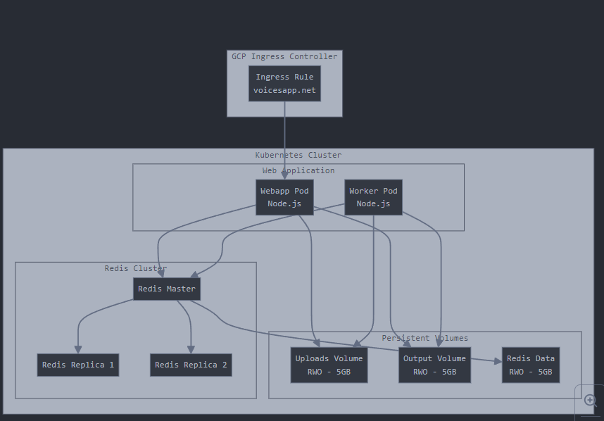

# terraform_google

# AWS EKS Voice Application Infrastructure

This repository contains Terraform configurations for deploying a scalable voice application infrastructure on AWS EKS. The infrastructure includes EKS cluster, VPC networking, EFS storage, and all necessary components for running a containerized voice processing application.




## Features

- **EKS Cluster**: Managed Kubernetes cluster with autoscaling node groups
- **High Availability**: Multi-AZ deployment across 3 availability zones
- **Persistent Storage**: EFS storage for application data and Redis persistence
- **Networking**: Custom VPC with public and private subnets
- **Security**: Private networking with NAT Gateways for outbound traffic
- **Load Balancing**: Application load balancer with SSL termination
- **DNS Management**: Automated DNS management with external-dns
- **Monitoring Ready**: Prepared for CloudWatch integration

## Prerequisites

- AWS CLI configured with appropriate credentials
- Terraform >= 1.0
- kubectl installed
- Helm v3.x
- Domain name registered in Route53

## Quick Start

1. Clone the repository:
```bash
git clone https://github.com/your-org/voice-app-infrastructure
cd voice-app-infrastructure
```

2. Initialize Terraform:
```bash
terraform init
```

3. Configure variables in a `terraform.tfvars` file:
```hcl
region             = "eu-central-1"
environment        = "production"
domain_name        = "your-domain.com"
cluster_name       = "voice-app-cluster"
vpc_cidr           = "10.0.0.0/16"
az_count           = 3
kubernetes_version = "1.31"
```

4. Deploy the infrastructure:
```bash
terraform apply
```

5. Configure kubectl:
```bash
aws eks update-kubeconfig --name voice-app-cluster --region eu-central-1
```

## Module Structure

```
.
├── modules/
│   ├── eks/                 # EKS cluster configuration
│   ├── vpc/                 # VPC and networking
│   ├── efs/                 # EFS storage configuration
│   ├── k8s_resources/      # Kubernetes resources
│   ├── voice_app/          # Voice application deployment
│   ├── external_dns/       # DNS configuration
│   └── route53/            # Route53 DNS zone management
├── main.tf                 # Main configuration file
├── variables.tf            # Variable definitions
├── outputs.tf             # Output definitions
└── README.md              # This file
```

## Configuration

### Required Variables

| Name | Description | Type | Default |
|------|-------------|------|---------|
| region | GCP region | string | eu-central-1 |
| domain_name | Domain name for the application | string | - |
| environment | Environment name | string | production |
| cluster_name | Name of the EKS cluster | string | voice-app-cluster |

### Optional Variables

| Name | Description | Type | Default |
|------|-------------|------|---------|
| vpc_cidr | CIDR block for VPC | string | 10.0.0.0/16 |
| az_count | Number of availability zones | number | 3 |
| kubernetes_version | Kubernetes version | string | 1.31 |

## Security Considerations

- EKS cluster is deployed in private subnets
- Worker nodes use IAM roles with least privilege
- Network access is controlled via Security Groups
- SSL/TLS termination at the load balancer
- Private endpoints for AWS services

## Monitoring and Maintenance

1. Access EKS Dashboard:
```bash
kubectl proxy
```

2. View cluster status:
```bash
kubectl get nodes
kubectl get pods --all-namespaces
```

3. Check application logs:
```bash
kubectl logs -n voiceapp deployment/voice-app
```

## Troubleshooting

Common issues and solutions:

1. **Cluster Creation Timeout**
   - Check VPC endpoints and internet connectivity
   - Verify IAM roles and permissions

2. **Storage Issues**
   - Ensure EFS mount points are accessible
   - Check security group configurations

3. **DNS Problems**
   - Verify Route53 zone configuration
   - Check external-dns logs

## Cost Optimization

- Use spot instances for worker nodes where possible
- Implement cluster autoscaling
- Monitor EFS usage and lifecycle policies
- Use appropriate instance types for workloads

## Contributing

1. Fork the repository
2. Create a feature branch
3. Commit your changes
4. Push to the branch
5. Create a Pull Request

## License

MIT License - see the [LICENSE](LICENSE) file for details

## Support

For support and questions, please open an issue in the repository.